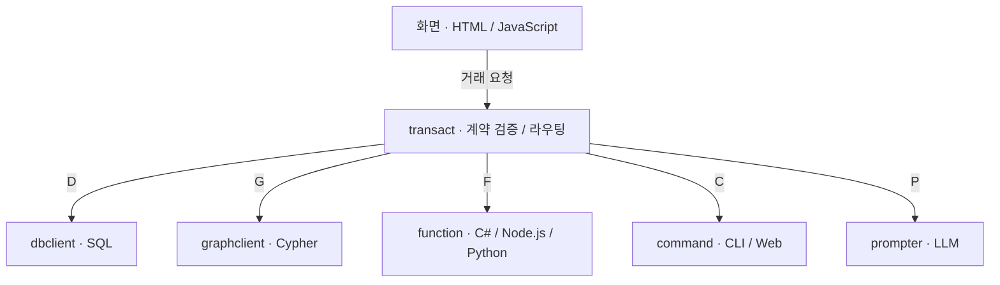

<p align="center">
  <picture>
    <source media="(prefers-color-scheme: dark)" srcset="2.Modules/wwwroot/wwwroot/img/logo-white.svg">
    
  </picture>
</p>

# HandStack

**HTML · JavaScript · SQL로 만드는 업무 앱, 개발부터 운영까지.**

HandStack은 화면, 데이터, 업무 로직을 계약으로 연결하는 오픈소스 업무 앱 개발 플랫폼입니다. .NET 10 기반 호스트에 필요한 모듈을 조합하고, 로컬 PC부터 자체 서버와 클라우드까지 직접 운영할 수 있습니다.

[](1.WebHost/ack/ack.csproj)
[](LICENSE.md)


[공식 문서](https://handstack.kr/docs/startup/개요) · [내 PC에서 실행하기](https://handstack.kr/docs/startup/빠른-시작) · [릴리스 다운로드](https://github.com/handstack77/handstack/releases/latest) · [유튜브](https://www.youtube.com/@handstack-kr)

## HandStack으로 할 수 있는 일

- **익숙한 언어로 업무 화면 개발** — HTML·JavaScript·SQL과 공통 UI 컨트롤로 조회, 입력, 파일 처리 화면을 구성합니다.
- **계약으로 화면과 서버 연결** — JSON·XML 파일에 거래의 입력·출력과 실행 규칙을 정의하고, `transact`에서 검증·라우팅·응답을 처리합니다.
- **데이터와 업무 로직 확장** — SQL·그래프 DB, C#·Node.js·Python 함수, CLI·웹 명령을 모듈로 연결합니다.
- **업무 흐름에 AI 기능 추가** — `prompter`에서 LLM 프롬프트를 계약으로 관리하고, 허용한 MCP 서버와 도구를 연결합니다.
- **개발과 운영을 함께 관리** — 파일 저장소, 로그 수집, 관리 화면, 프로세스 제어와 배포 도구를 제공합니다.

화면·계약·서버 코드를 분리해 관리합니다. 계약 변경은 모듈의 파일 감시·갱신 설정에 따라 반영되며, 호스트·모듈 코드 변경은 빌드와 재시작이 필요합니다.

## 빠른 시작

처음에는 배포본으로 서버를 실행하고, 게시판 예제에서 데이터가 화면으로 돌아오는 흐름을 확인하세요.

| 단계 | 할 일 | 완료 기준 |
| --- | --- | --- |
| 1. [필수 도구 준비](https://handstack.kr/docs/startup/install/필수-프로그램-설치하기) | .NET SDK 10, Node.js·npm, gulp-cli, curl 확인 | 각 도구의 버전 출력 |
| 2. [내 PC에서 실행하기](https://handstack.kr/docs/startup/빠른-시작) | OS·CPU에 맞는 배포본 다운로드 → 설치 스크립트 실행 → `ack` 시작 | 관리 화면 접속 |
| 3. [게시판 실습](https://handstack.kr/docs/startup/handsonlab/게시판-프로젝트-시작하기) | 예제 목록을 조회하고 검색 조건 변경 | 조건에 맞는 조회 결과 확인 |

기본 접속 주소는 `http://localhost:8421/checkup/account/signin.html`입니다. 최초 관리 계정은 서버 실행 로그에서 확인하세요. 실행이 막히면 [ack 운영 가이드](1.WebHost/ack/README.md)의 점검·장애 대응 절차를 참고하세요.

## 소스에서 실행

호스트나 모듈을 직접 수정하려면 저장소를 복제해 빌드합니다. 아래 예제는 **PowerShell 7** 기준이며, .NET SDK 10, Node.js·npm, gulp-cli, curl, Git이 필요합니다. Node.js의 프로젝트 최소 요구 버전은 `20.12.2`이며, 새 환경의 버전 선택은 [필수 도구 안내](https://handstack.kr/docs/startup/install/필수-프로그램-설치하기)를 따르세요.

> 설치 스크립트는 사용자 환경 변수·도구를 구성합니다. 빌드는 `HANDSTACK_HOME` 아래의 실행 파일·모듈·계약 복사본을 갱신하므로 기존 운영 경로와 분리하세요. 기본 출력 경로는 저장소의 상위 디렉터리 아래 `build/handstack`입니다.

```powershell
git clone https://github.com/handstack77/handstack.git
cd handstack

./env.ps1
./install.ps1
./build.ps1

# 기본 ack 설정에 포함된 forwarder는 별도로 빌드합니다.
dotnet build 2.Modules/forwarder/forwarder.csproj -c Debug

dotnet "$env:HANDSTACK_HOME/app/ack.dll" --port=8421
```

서버를 켠 상태에서 `http://localhost:8421/checkip`의 응답과 위 관리 화면의 접속을 확인하세요. 각 명령은 성공 여부를 확인한 뒤 다음 단계로 진행합니다.

Windows 배치와 macOS·Linux용 `.sh` 스크립트도 제공합니다. OS별 빌드 대상은 일부 다르며, `rdy`는 별도 빌드 대상입니다. 자세한 내용은 [소스 개발 환경](https://handstack.kr/docs/startup/install/개발-환경-설정하기), [빌드·배포 범위](SUMMARY.md), [ack 운영 가이드](1.WebHost/ack/README.md)를 참고하세요.

## 동작 구조

**계약(contracts)** 은 어떤 거래를 실행하고 어떤 데이터를 주고받을지 정한 파일입니다. 화면에서 거래를 요청하면 `transact`가 계약을 읽고 실행 모듈로 전달합니다.



기본 거래 진입점은 `/transact/api/transaction/execute`입니다. 실행 결과는 `transact`에서 응답으로 조립되어 화면으로 돌아옵니다.

- **`ack`** 는 `appsettings.json`에서 모듈을 선택하고, 각 모듈의 `module.json`과 DLL을 읽어 `ModuleInitializer`로 연결합니다.
- **`rdy`** 는 기본 모듈을 정적 참조로 포함하고, 추가 모듈은 동적으로 로드하는 호스트입니다.
- **업무 계약과 화면 자산**은 주로 `2.Modules/*/Contracts`에서 시작하며, 실행 시 모듈 설정에 따라 `HANDSTACK_HOME/contracts`와 `HANDSTACK_HOME/modules`를 사용합니다.

확장 지점과 요청 흐름은 [아키텍처 안내](SUMMARY.md), 거래의 요청·응답 규칙은 [계약 중심 거래](https://handstack.kr/docs/reference/concept/계약-중심-거래)에서 확인할 수 있습니다.

## 저장소 둘러보기

```text
handstack/
├── 1.WebHost/         # ack · rdy · agent · deploy · forbes
├── 2.Modules/         # 업무 실행 모듈, 계약, 정적 자산
├── 3.Infrastructure/  # HandStack.Core · Data · Web 공통 라이브러리
├── 4.Tool/            # 개발·운영·배포 CLI와 도구
├── handstack.sln      # .NET 솔루션
└── env.* · install.* · build.* · publish.*
```

필요한 기능부터 해당 모듈의 문서를 읽으세요.

| 역할 | 모듈 |
| --- | --- |
| 화면·정적 자산 | [wwwroot](2.Modules/wwwroot/README.md) |
| 거래·워크플로 | [transact](2.Modules/transact/README.md) |
| SQL·그래프 데이터 | [dbclient](2.Modules/dbclient/readme.md) · [graphclient](2.Modules/graphclient/README.md) |
| 함수·명령·AI 실행 | [function](2.Modules/function/README.md) · [command](2.Modules/command/README.md) · [prompter](https://handstack.kr/docs/reference/api/modules/prompter) |
| 파일·로그·관리 | [repository](2.Modules/repository/README.md) · [logger](2.Modules/logger/README.md) · [checkup](2.Modules/checkup/README.md) |
| HTTP 포워드 프록시 | [forwarder](2.Modules/forwarder/README.md) |

운영 도구는 [handstack CLI](4.Tool/CLI/handstack/README.md), 호스트별 역할은 [ack](1.WebHost/ack/README.md) · [agent](1.WebHost/agent/README.md) · [deploy](1.WebHost/deploy/README.md) · [forbes](1.WebHost/forbes/README.md)에 정리되어 있습니다.

## 문서와 학습

| 목적 | 읽을 문서 |
| --- | --- |
| 예제를 따라 업무 앱 만들기 | [따라 만들기](https://handstack.kr/docs/tutorial/) |
| 거래의 요청·응답 확인하기 | [계약 중심 거래](https://handstack.kr/docs/reference/concept/계약-중심-거래) |
| 서버 실행·설정 확인하기 | [ack 프로그램 레퍼런스](https://handstack.kr/docs/reference/api/ack-프로그램) |
| 구조와 설계 배경 이해하기 | [모듈러 모놀리식 아키텍처](https://handstack.kr/docs/reference/concept/모듈러-모놀리식-아키텍처) |
| 영상으로 학습하기 | [HandStack 유튜브 채널](https://www.youtube.com/@handstack-kr) |

## 참여하기

버그 제보, 문서 개선, 기능 제안을 환영합니다. [Issues](https://github.com/handstack77/handstack/issues)에 사용 환경과 재현 절차를 남기거나, [기여 안내](https://handstack.kr/docs/information/community/기여하기)를 확인한 뒤 Pull Request를 보내주세요.

협업 문의: [handstack77@gmail.com](mailto:handstack77@gmail.com)

## 라이선스

HandStack은 [MIT 라이선스](LICENSE.md)로 공개되며 개인·기업의 상업적 사용이 가능합니다. 함께 사용하는 라이브러리와 UI 컨트롤은 각 패키지의 라이선스를 확인하세요.
